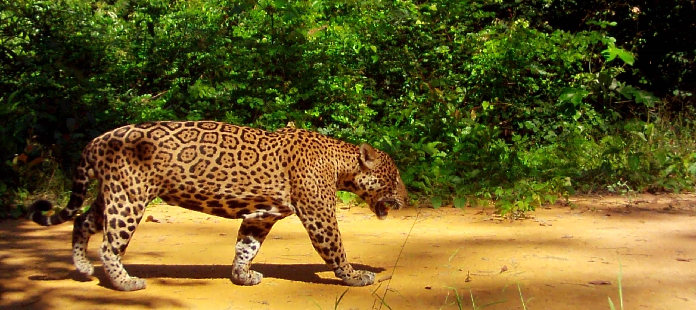

---
output:
  html_document:
      theme: paper
---
 

**Amazonian mammal research**

<left>

I am intrigued and fascinated by how Amazonia is one of the most biodiverse, and at the same time, most poorly studied places in the world. I am broadly interested in ecology and conservation of Amazonian mammals, particularly understudied and threatened species. My research focuses on the carnivores due to their ecological attributes, appeal as flagship species, and perceived threat to people. I hope this web site will help me to connect with people with similar interests.

 

{width=900px}

 

**Affiliations**

###### University of California, Davis

###### Department of Wildlife, Fish, and Conservation Biology

###### [The Sollmann Lab](https://sollmannlab.faculty.ucdavis.edu/)

 

###### Instituto de Desenvolvimento Sustentável Mamirauá

###### [Grupo de Pesquisa em Ecologia e Conservação de Felinos na Amazônia](https://www.mamiraua.org.br/gp-felinos)