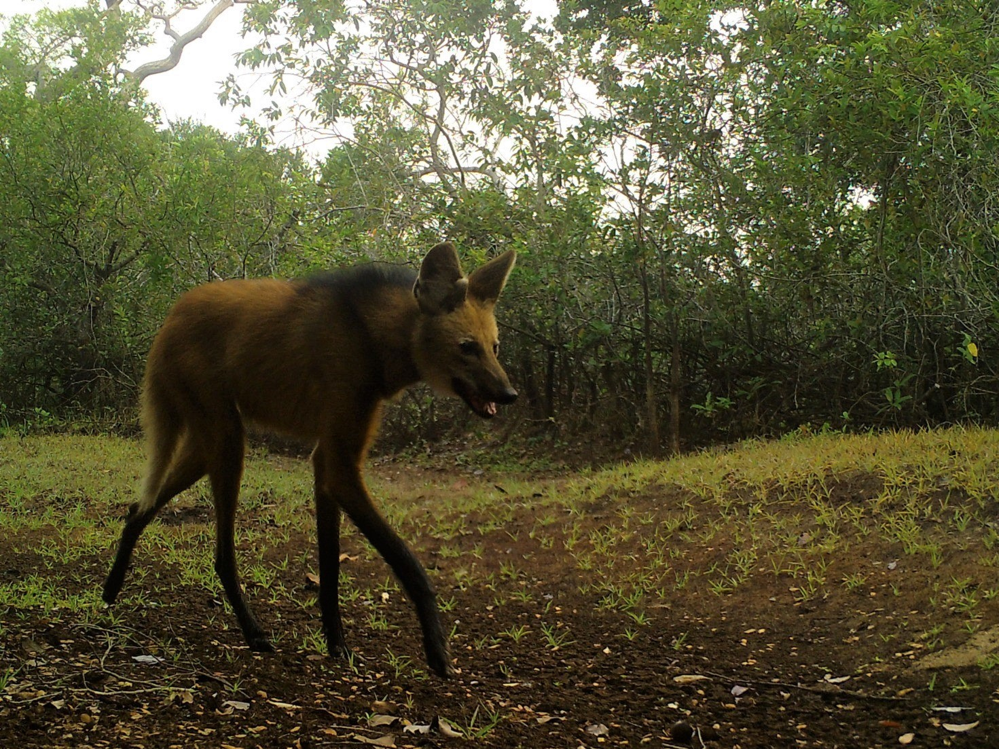
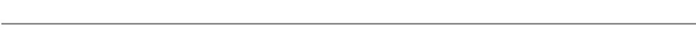
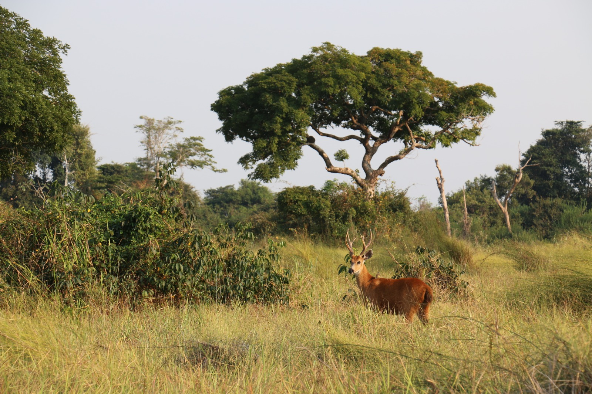
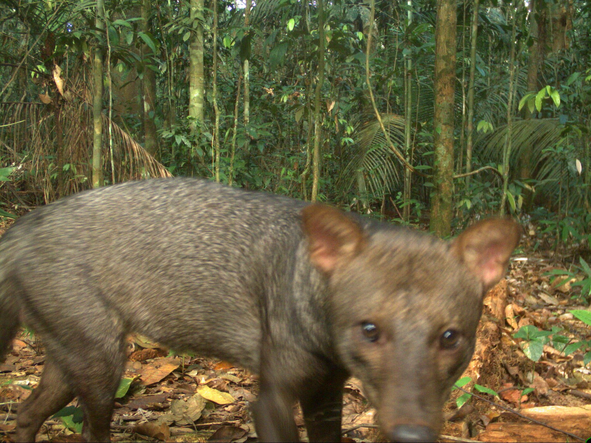
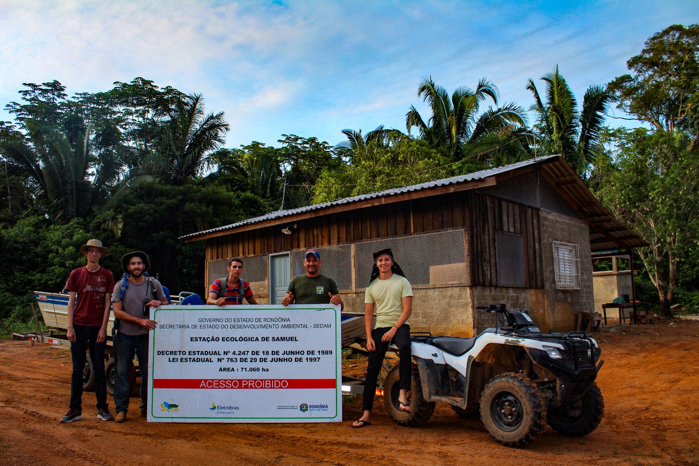

---
output:
  html_document:
      theme: paper
---

 

**News**

**Dec 2020:** 
The Guapore Biological Reserve (GBR) is another protected area in the Southern Brazilian Amazon that we surveyed with camera trap this year. GRB encompasses areas of Amazon forest and Cerrado (Brazilian savannah). One peculiarity of GBR is the feral buffalo population that has invaded its southern areas. Hopefully, our camera trap survey will allow us to access the effect of the buffalos on the native mammal community.    
 

Photo: Maned wolf, Chrysocyon brachyurus, at Guapore Biological Reserve. (by Daniel Rocha)

 

{width=1000px}
 

**Oct 2020:** Corumbiara State Park (CSP) sits right in the border of three important ecosystems in Brazil: the Amazon forest, the Cerrado (savannah) and Pantanal. This unique composition makes CDP very promising in terms of biodiversity. Yet, our camera trap survey was the first systematic mammal research ever carried out within the CSP. Among all protected area we have collected data in the southern Brazilian Amazon, CSP is by far the best region for wildlife sighting. Besides large mammal (jaguar, giant anteater, giant other, giant armadillo, and marsh deer), we saw innumerous aquatic and semi-aquatic bird species. 

Photo: Marsh deer, blastocerus dichotomus, at Corumbiara State Park. (by Daniel Rocha)

 

**May 2020:** 
The short-eared dog only occurs in the Amazon and it is one of the least known canid species worldwide. The short-eared dog is so elusive that no single researcher has enough data to say much about it. Because of that, we combined data from 50 researchers all over Amazonia to make the first [scientific paper](https://doi.org/10.1098/rsos.190717) focused exclusively on the short-eared dog. We discovered that, although rare, the species is still present in large areas of Amazonia. However, the species is seriously threatened by forest loss. This is particularly concerning because the short-eared, like many other Amazonian species, is highly dependent on good quality forest. There is a nice [New York Times article](https://www.nytimes.com/2020/05/04/science/ghost-dog-amazon-rainforest.html) about this research.   
 

Photo: Short-eared dog, Atelocynus microtis, at Campos Amazonicos National Park. (by Daniel Rocha)

{width=1000px}
 

<left>**Aug 2019:** Since 2016, we have conducted mammal surveys in collaboration with protected area managers within the southern Brazilian Amazonia savannah regions. To our surprise, we encountered species well outside their current known distribution. One of these was the pampas deer, which is listed as Vulnerable in the Brazilian Red List of Threatened Species. More recently, our friend and videographer Laurie Hedges joined us in an expedition to document the pampas deer in the southern Amazonian savannahs. Among the exceptional footage that Laurie captured was the region’s first record of the globally Endangered crowned solitary eagle, another unexpected species for this region. For more information, click on the savanna photo (on the right) to see a short video about these new discoveries. You may want to check our [Oryx blog post](https://www.oryxthejournal.org/blog/the-hidden-and-unexpected-savannahs-species-of-amazonia/) as well.

{width=1000px}
 

**Feb 2019:** We have just completed our camera trap survey at Samuel Ecological Station (SEE). Besides being the first systematic survey on medium and large-sized mammals within SEE, this study aimed to understand the impacts of the hydroelectric dam reservoir on the mammal community in the continuous forest adjacent to the reservoir. Lucas Gonçalves and Felipe Pessoa joined the field trip to conduct bat survey. This study was funded by The Alongside Wildlife Foundation, University of California-Davis and SEDAM-Rondônia.

Photo (L-R): Felipe, Daniel, Finicius, Fabio and Lucas at SEE research base. (by Lucas Gonçalves)

 

{width=1000px}

