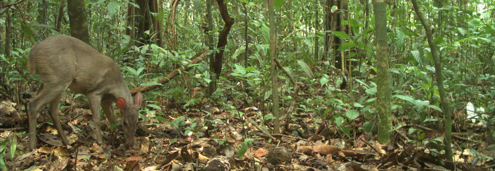

---
output:
  html_document:
      theme: paper
---
 

**Publications**

I am happy to share a pdf version of the papers below that you do not have free access.
 

 
**2020**

**Rocha DG**, de Barros FKMPM, Gonçalves L, Tan CKW, Lemos FG, Ortiz C, Peres CA, Negroes N, Antunes AP, Rohe F, Abrahams M, Zapata-Rios G, Teles D, Oliveira T, von Muhlen EM, Venticinque, Grabin DM, Mosquera BD, Blake J, Lima MGM, Sampaio R, Percequillo AR, Peters F, Payan E, Borges LHM, Calouro AM, Endo W, Pitman RL, 
Haugaasen T, Silva DA, de Melo FR, de Moura ALB, Costa HCM, Lugarini C, de Sousa IG, Nienow S, Santos F, Mendes-Oliveiras AC, Del Toro-Orozco W, D'Amico AR, Albernaz AL, Ravetta A, do Carmo ECO, Ramalho EE, Valsecchi J, Giordano AJ, Wallace R, Macdonald DW and Sollmann R. 2020. Wild dogs at stake: deforestation threatens the only Amazon endemic canid, the short-eared dog (Atelocynus microtis). Royal Society of Open Science. 7190717 [(article)](https://doi.org/10.1098/rsos.190717)

 
**2019**

**Rocha DG**, Hedges L, and Cambraia BC. 2019. Endangered crowned solitary eagle Buteogallus coronatus in the threatened Amazonian savannah. Oryx. 53(4), 607-608. [(article)](https://doi.org/10.1017/S0030605319000516)

Lopes GP, Jaskulski A, Santos AT, Montanarin A, **Rocha DG**, Gräbin DM, Ramalho EE, Alvarenga GC, Bizri HRE, Junqueira I, Cobra IVD, Gomes L, Araújo M, Pereira P, Gonçalves JR, Cardoso N, Ilha R, Carvalho R and Valsecchi J. 2019. Mamíferos terrestres. in Sociobiodiversidade da Reserva de Desenvolvimento Sustentável Amanã (1998-2018): 20 anos de pesquisas (eds A. C. S. do Nascimento, et al.). Tefé, AM. Instituto Desenvolvimento Sustentável Mamiraua. 352p. [(article)](https://www.mamiraua.org.br/documentos/1a8fb464341de84156fef2c2eb778be3.pdf)

**Rocha DG**, Vogliotti A, Gräbin DM, Assunção WRC, Cambraia BC, D’amico AR, Portela, AE, Sollmann R. 2019. New populations of pampas deer Ozotoceros bezoarticus discovered in the threatened Amazonian savannah enclaves. Oryx. early view. [(article)](https://doi.org/10.1017/S0030605318001539)

Wang B, **Rocha DG**, Abrahams MI, Antunes AP, Costa HCM, Gonçalves ALS, Spironello WR, Paula MJ, Peres AC, Pezzuti J, Ramalho EE, Reis ML, Carvalho Jr E, Rohe F, Macdonald DW, Tan CKW. Habitat use of the ocelot (Leopardus pardalis) in Brazilian Amazon. 2019. Ecology and Evolution, 9, 5049–5062. [(article)](https://onlinelibrary.wiley.com/doi/full/10.1002/ece3.5005)  

**Rocha DG**, Kaefer IL. 2019. What has become of the Refugia Hypothesis to explain biological diversity in Amazonia? Ecology and Evolution, 9, 4302–4309. [(article)](https://onlinelibrary.wiley.com/doi/full/10.1002/ece3.5051)  

Rabelo RM, Goncalves JR, Silva FE, **Rocha DG**, Canale GR, Bernardo CSS, Boubli JP. 2019. Predicted distribution and habitat loss for the endangered Black-faced black spider monkey (Ateles chamek) in the Amazon. Oryx, early view. [(article)](https://www.cambridge.org/core/journals/oryx/article/predicted-distribution-and-habitat-loss-for-the-endangered-blackfaced-black-spider-monkey-ateles-chamek-in-the-amazon/92CEC320AC2D822602B47061348E1E2C)

 
 **2018**

Agha M, Batter T, Bolas EC, Collins AC, **Rocha DG**, Monteza‐Moreno CM, Preckler‐Quisquat S., Sollmann R. 2018. A review of wildlife camera trapping trends across Africa. African Journal of Ecology, 56(4), 694-701. [(article)](https://onlinelibrary.wiley.com/doi/full/10.1111/aje.12565)

Alvarenga GC, Ramalho EE, Baccaro FB, **Rocha DG**, Ferreira-Ferreira J, Bobrowiec PED. 2018. Spatial dynamics of medium- and large-sized mammal assemblages in várzea and terra firme forests, Central Amazonia, Brazil. PLoS ONE 13(5), e0198120. [(article)](https://journals.plos.org/plosone/article?id=10.1371/journal.pone.0198120)

Azevedo FC, Lemos FG, Freitas-Júnior MC, **Rocha DG**, Azevedo FCC. 2018. Puma activity patterns and temporal overlap with prey in a human-modified landscape at Southeastern Brazil. Journal of Zoology. 305(4), 246-255. [(article)](https://zslpublications.onlinelibrary.wiley.com/doi/full/10.1111/jzo.12558)

 
 **2017**

Tan CKW1, **Rocha DG**1, Clements GR, Brenes-Mora E, Hedges L, Kawanishi K, Mohamad SW, Rayan DM, Bolongon G, Moore J, Wadey J, Campos-Arceiz A, Macdonald DW. 2017. Habitat use and predicted range for the mainland clouded leopard _Neofelis nebulosa_ in Peninsular Malaysia. Biological Conservation, 206, 65-74. 1joint first authors. [(article)](https://www.sciencedirect.com/science/article/pii/S0006320716305134)

 
<left> **2016**

**Rocha DG**, Ramalho EE, Magnusson WE. 2016. Baiting for carnivores might negatively affect capture rates of prey species in camera-trap studies. Journal of Zoology, 300(3), 205-212. [(article)](https://zslpublications.onlinelibrary.wiley.com/doi/full/10.1111/jzo.12372)

Azevedo FC, Lemos FG, **Rocha DG**, Costa AN, Freitas-Junior MC. 2016. New-record of the bush dog _Speothos venaticus_ in a human altered landscape in the west of Minas Gerais, Brazil. Bioscience Journal (Online), 32, 1324-1330. [(article)](http://www.seer.ufu.br/index.php/biosciencejournal/article/view/33302)

**Rocha DG**, Sollmann R, Ramalho EE, Ilha R, Tan CKW. 2016. Ocelot (_Leopardus pardalis_) density in Central Amazonia. PLoS ONE, 11, e0154624. [(article)](https://journals.plos.org/plosone/article?id=10.1371/journal.pone.0154624)

 
<left> **2015**

**Rocha DR**, Ramalho EE, Alvarenga GC, Gräbin DM, Magnusson WE. 2015. Records of the bush dog (Speothos venaticus) in Central Amazonia, Brazil. Journal of Mammalogy, 96(5), 1361-1364. [(article)](https://academic.oup.com/jmammal/article/96/6/1361/1176523)

**Rocha DG**. 2015. Activity patterns and factors that affect medium- and large- sized terrestrial mammal surveys in Central Amazonia. Mastozoología Neotropical, 22(1), 204-205. [(article)](https://www.redalyc.org/revista.oa?id=457#)

 
<left> **2014**

Morcatty TQ, Valsecchi J, **Rocha DG**. 2014. Geographic distribuition _Platemys latycephala platycephala_. Herpetological Review, 45(4), 657. [(PDF)](https://www.dropbox.com/s/0jsfnoliczl5xv3/HR%20Dec%202014%20ebook.pdf?dl=1)

 
<left> **2013**

**Rocha DG**, Passamani M. 2013. Influence of pitfall designs and use of baits on the capture of small mammals in Southern Minas Gerais, Brazil - Acta Scientiarum. Biological Sciences (Online), 35, 499-503. [(PDF)](http://www.redalyc.org/service/redalyc/downloadPdf/1871/187129138006/6)

 

{width=900px}