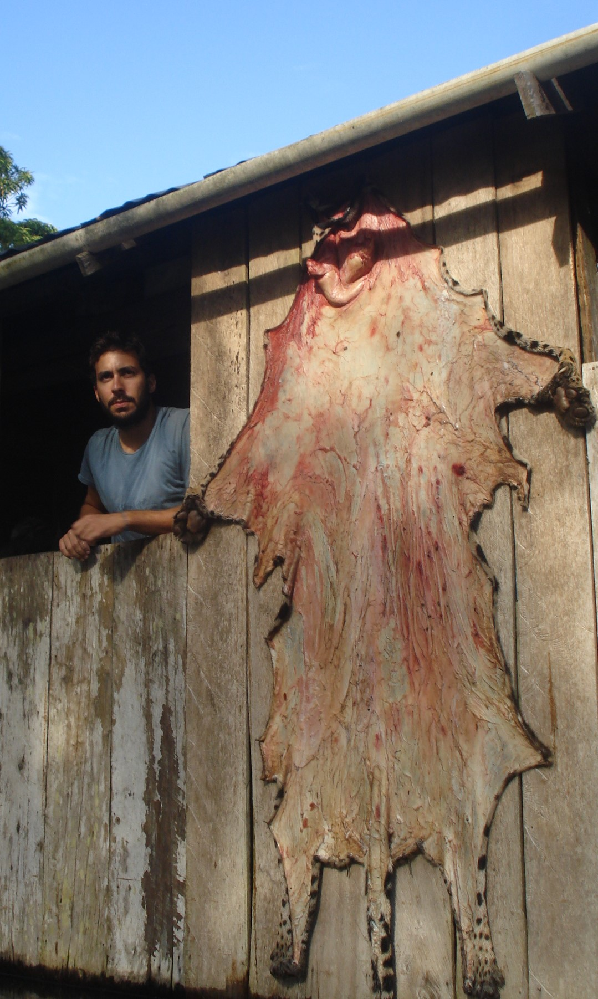
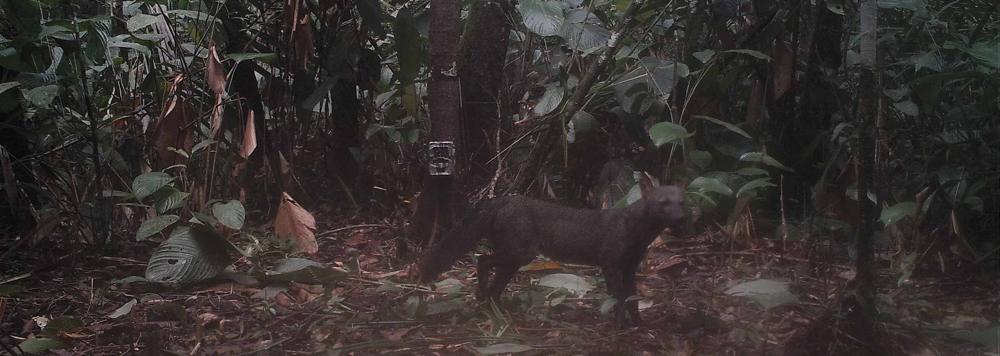

---
output:
  html_document:
      theme: paper
---
 

**Research**

{width=900px}

<left> 
The Amazonian forest is the largest tropical forest in the world and arguably the most biodiverse terrestrial ecosystem. For the past decades, Amazonia has experienced unprecedented threats, particularly the persistent high deforestation rates, widespread use of fire, and global climate change (1). It is expected that, with current trends, 40% of Amazonian forests will be cleared by 2050 (2), leaving behind highly fragmented forest patches in a human-dominated landscape. This ongoing drastic change in habitat availability and configuration raises concerns for the future of the many Amazonian forest-dependent wildlife species. To anticipate and mitigate the threats to wildlife, it is important to understand how species are affected by the rapidly changing landscape and increasing human presence. 

Mammalian carnivores (Order Carnivora) are experiencing severe declines in their populations and geographic ranges worldwide. Owing to their fundamental importance in the maintenance of the structure and function of terrestrial ecosystems, declines in carnivore population have direct and indirect effects on several processes including diversity maintenance, disease dynamics, carbon sequestration and stream flow (3). The primary drivers of carnivore declines are **habitat loss** and **human persecution** (4), and therefore, those are the main focus of my research.

Our study area is in the southern Brazilian Amazonia, an area located in the middle of the “Arc of Deforestation”, the region with highest deforestation rates in Brazil due to rapid expansion of the agriculture frontier. Additional habitat degradation is expected in the region because of the local government’s ongoing plans for infrastructure expansion. As human occupation develops into the Southern Brazilian Amazonia, we expect an increase in habitat degradation and in interactions between local settlers and carnivores (e.g. jaguar, puma, wild dogs, ocelot, among others), most likely with negative consequences for both sides.

 

 

**Habitat Loss and Fragmentation**

To understand how carnivores respond to the ongoing forest cover changes in the Amazonia, we are conduct a systematic landscape camera-trap survey in the southern Brazilian Amazonia, representing a range of land cover including continuous forest, open savannas, transitional forest-savanna areas and forested patches under anthropogenic impact. We will use camera trap data in combination with statistical models that takes into account imperfect observation processes to investigate the effect of relevant habitat and anthropogenic variables on species occurrence.

 

 

 

 

 

 

**Human – Carnivore Interactions**

Despite their ecological role, carnivore behaviors often pose a direct threat to livestock, livelihood and safety of the people that live near them. We want to understand people`s feelings, attitudes and opinions towards carnivores to better propose strategies that foster coexistence between people and carnivores. For this objective, we are conducting a large-scale questionnaire survey that spatially overlaps with our camera trap survey.

 

 

 

 

 

 

 
**The Amazon-Cerrado Ecotone** 

The Amazonia is poorly studied (5). Consequently, we still lack of knowledge on species ecology, including basic aspects such as their distributions. Moreover, large areas of the Amazonian forests have never been properly surveyed. This is worrying because some of those areas are under severe threat, and we are risking lose tracts of Amazonian biodiversity before they are discovered.

The southern Brazilian Amazonia is one of those poorly studied and severely threatened areas. It is located at the border of the Amazonian forest and the Brazilian savanna (Cerrado), comprising heterogeneous mosaics of open areas and forests with a highly diverse faunal community composed of savannah and forest species. 
Our extensive surveys in this region will help to refine Amazonian species distribution limits and have the potential to document distribution range shifts as forest cover decreases in response to land use and climate change.

{width=900px}

 

 

**References**

1.	Lovejoy, T. E. & Nobre, C. Amazon tipping point. Sci. Adv. 4, 1–2 (2018).

2.	Soares-Filho, B. S. et al. Modelling conservation in the Amazon basin. Nature 440, 520–523 (2006).

3.	Ripple, W. J. et al. Status and Ecological Effects of the World’s Largest Carnivores. Science (80) 343, (2014).

4.	Woodroffe, R., Thirgood, S. & Rabinowitz, A. People and Wildlife: conflict or coexistence. (2005).

5.	Leite, R. N. & Rogers, D. S. Revisiting Amazonian phylogeography: Insights into diversification hypotheses and novel perspectives. Org. Divers. Evol. 13, 639–664 (2013).

